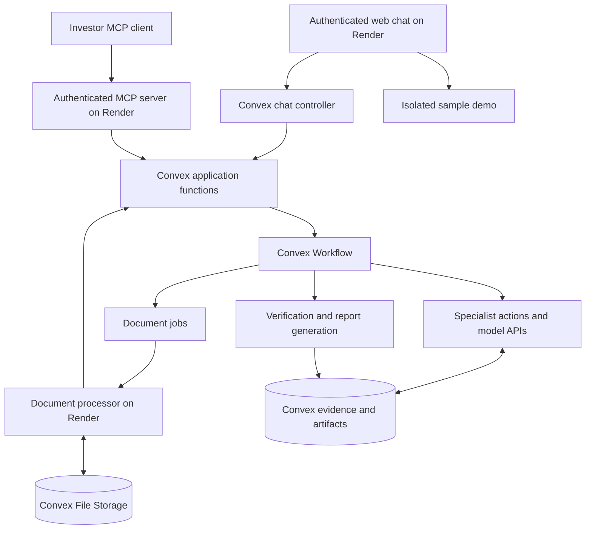

# Investor diligence assistant — implementation plan

Status: Convex synthetic workflows, browser Password login, private workspace/upload APIs, authenticated MCP resource-server foundation, and a live Grok workflow for uploaded documents (behind a deployment kill switch, tested against a simulated provider) are implemented. A paid provider smoke test and evidence evaluation, MCP OAuth account setup, chat, and client certification remain pending.
Updated: 2026-09-12.

## Product objective

Help investors and VCs examine pitch decks and discussion transcripts before or during due diligence. Coordinate specialist agents, preserve intermediate results, and produce a report with precise evidence references, uncertainties, and follow-up questions.

The product identifies potential problems and inconsistencies. It must distinguish company assertions, model inferences, deterministic checks, and independent corroboration. Missing evidence is not proof of misconduct.

## Agreed decisions

- TypeScript is the primary application language.
- Convex owns application data and durable workflow orchestration.
- Render hosts a remote MCP server and document-processing service.
- The MCP server is exposed over HTTPS and requires authentication.
- Ship a website with authentication, a chat interface for use without MCP, and a visible demo-mode switch. Web and MCP share the same case permissions and analysis backend.
- Give “Connect via MCP” equal prominence to web chat as a primary website action, with a fast setup path for ChatGPT, Claude, and Grok.
- Analysis runs continue independently of chat connections.
- Agent outputs are stored as versioned artifacts and reused as explicit inputs to later runs.
- Ship a companion skill that guides assistants through the investor workflow.
- Keep essential interaction guidance in MCP server instructions and tool descriptions so clients without skill support remain usable.
- Support multiple MCP applications through tested compatibility, rather than assuming identical capabilities across ChatGPT, Copilot, Claude, Grok, and other clients.

## Baseline stack

| Concern             | Initial choice                                                           |
| ------------------- | ------------------------------------------------------------------------ |
| Repository          | pnpm workspaces, TypeScript, supported Node.js LTS                       |
| MCP                 | Official TypeScript MCP SDK; Streamable HTTP                             |
| Backend             | Convex functions, database, and File Storage                             |
| Orchestration       | `@convex-dev/workflow`                                                   |
| Model integration   | Native xAI Files/Responses adapter for MVP                               |
| Validation          | Zod for agent contracts; Convex validators for persistence boundaries    |
| Retrieval           | Convex text/vector search and indexed metadata queries                   |
| Document processing | Containerized worker on Render; parser selected after fixture evaluation |
| Web application     | React + Vite, hosted on Render                                           |
| Verification        | Vitest, convex-test, MCP integration tests                               |

Pin compatible dependency versions during scaffolding. Convex Agent is optional if a specialist later needs richer conversation or tool-loop management. Do not introduce a second orchestration owner initially.

## Architecture and ownership



### MCP service

Own transport, authentication integration, tool contracts, and response formatting. Delegate business logic to authorization-aware Convex functions. Do not keep authoritative run state in process memory.

### Convex backend

Own membership checks, case data, source versions, run snapshots, workflow progress, context manifests, findings, and reports. Use actions for external calls and mutations for transactional state changes. Pass IDs through workflow history instead of full document bodies.

### Document processor

Own parsing, OCR/rendering where needed, extraction quality metadata, and precise source anchors. Keep orchestration code in TypeScript; permit native tools or a contained Python parser when evidence quality warrants it.

### Web application and chat

Provide a public introduction, sign-in/sign-up flow through the chosen Convex-backed authentication, and an authenticated workspace with case selection, secure uploads, chat, progress, and report/evidence review. Users can complete the diligence journey entirely on the website without installing or connecting MCP.

Present “Chat here” and “Connect via MCP” side by side with equal prominence on the website and in the workspace. The MCP connect button opens a client picker for ChatGPT, Claude, and Grok, followed by the shortest verified setup/authentication flow for that client. Use supported connection links where available; otherwise provide a copyable server URL and concise client-specific steps. Offer the companion skill as part of setup where supported. Do not promise one-click installation or show a successful connection until the client flow has actually been verified.

A server-side Grok chat controller interprets user requests and invokes the same authorized application functions exposed through MCP. The browser never receives model/service credentials. Do not implement separate analysis logic for web chat or make the browser connect through MCP. Link chat messages and tool actions to durable case/run/artifact IDs; reconnecting restores progress without restarting analysis. Allow authorized users to access the same case from the website or MCP.

Persist case-scoped `chatThreads` and `chatMessages` with actor identity, message status, and references to runs, evidence, and tool outcomes. Apply existing membership checks to history, streaming/subscriptions, and tool execution. Deduplicate repeated sends and analysis starts. Website session authentication and external MCP OAuth remain distinct entry paths into shared authorization.

### Demo-mode switch

Proposed MVP behavior: let visitors try a clearly labeled sample case without signing in, using synthetic decks/transcripts and precomputed findings/report. Provide suggested questions with curated responses; label those responses as demo examples rather than live model analysis. Free-form live demo chat is deferred until explicit rate limits and budget controls exist.

Keep the Demo / My workspace switch visible. Personal workspaces require authentication. Switching modes changes the active context and clears demo/private messages from the other view; it never copies private files or history into the demo. The server enforces separate demo access paths and fixed sample IDs. A client-provided demo flag must never bypass private-case authorization.

The initial demo accepts no private uploads and triggers no paid model calls. Explain that real-document upload and analysis require signing in and switching to the personal workspace. A signed-in user's private case is preserved when visiting the demo. Exact demo interaction design is provisional; the requirement for a demo switch is agreed.

## Authentication and authorization

1. Select an authorization provider and validate the MCP connection flow against the initial target clients before building the full analysis pipeline.
2. Implement applicable MCP authorization requirements, including discovery, authorization flow, and access-token validation. Check issuer, audience, expiry, and scopes; use established libraries/provider facilities.
3. Map verified identities to organization membership and case permissions. Never trust caller-supplied actor or tenant IDs as authority.
4. Choose an explicit MCP-to-Convex identity boundary: supported identity integration or narrowly scoped service endpoints carrying verified actor identity. Do not blindly forward tokens with the wrong audience or expose deployment/admin credentials.
5. Give document workers restricted service credentials and job-scoped access. Validate authorization again when committing results and serving artifacts.
6. Protect uploads, evidence reads, and downloads. Avoid exposing durable bearer file URLs for confidential materials; implement authenticated delivery.
7. Test expired/revoked access, cross-tenant IDs, unauthorized file reads, and client reconnection. Define membership-revocation behavior for queued/running work.

Secrets belong in deployment secret stores, never the repository, skill, or tool results.

## Public MCP interface

| Tool                    | Responsibility                                               |
| ----------------------- | ------------------------------------------------------------ |
| `create_case`           | Create a deal/company workspace                              |
| `list_cases`            | Discover authorized cases and resume work                    |
| `prepare_upload`        | Return a secure upload flow                                  |
| `attach_document`       | Validate and register an uploaded file as a document version |
| `start_analysis`        | Durably accept an analysis and return its run ID             |
| `get_analysis_status`   | Return stage progress, failures, and required input          |
| `list_findings`         | Return paginated findings with filters                       |
| `get_evidence`          | Return authorized, precisely anchored source material        |
| `get_report`            | Return a summary and access to the complete report           |
| `submit_analysis_input` | Add clarification or evidence for an explicit run/case       |
| `cancel_analysis`       | Request cancellation of a durable run                        |

Finalize tool schemas in milestone 2. `start_analysis` requires idempotency protection and acknowledges only after durable acceptance. Clarification within a run and a new document revision must have distinct semantics.

Return structured content plus concise readable text. Paginate large results and expose coverage gaps. Use ordinary start/status/result tools as the compatibility baseline; optional MCP Tasks, resources, or UI extensions must not be required. A transport disconnect is distinct from explicit cancellation of an accepted background analysis.

## Data and intermediate artifacts

| Collection                              | Purpose                                                                      |
| --------------------------------------- | ---------------------------------------------------------------------------- |
| `organizations`, `memberships`, `cases` | Ownership and access                                                         |
| `documents`, `documentVersions`         | Logical document identity, immutable revisions, hashes, file references      |
| `evidenceSpans`                         | Source excerpts, tables, page/slide regions, transcript speaker/time anchors |
| `analysisRuns`                          | Frozen input versions, workflow/configuration version, status, budget        |
| `agentRuns`                             | Specialist, attempts, model/prompt versions, usage, errors                   |
| `artifacts`                             | Validated intermediate outputs and dependency references                     |
| `contextManifests`                      | Exact context supplied to each agent                                         |
| `findings`                              | Evidence-linked issues, severity, evidence strength, disposition             |
| `reports`                               | Immutable report revisions and included findings                             |
| `documentJobs`                          | Processing state, leases, attempt tokens, results                            |

Each artifact records schema version, organization/case/run/step identifiers, producer versions, input document and artifact IDs, output payload or file reference, evidence references, validation status, timestamps, and usage metadata.

Each finding records the examined claim, category, severity, evidence strength, supporting and contradicting evidence, concise explanation, alternative explanations, missing information, and recommended follow-up.

Use a dedicated context builder. Assemble task instructions, pinned upstream artifacts, original evidence, counterevidence, and execution limits. Save the actual input or an exact reconstructable manifest including retrieval choices and truncation. Required upstream artifacts must be loaded by ID, not discovered only through semantic search.

Keep originals and large payloads in file storage. Preserve inspectable model outputs and tool results; do not depend on private model reasoning. Define retention/deletion across files, records, embeddings, workflow history, and logs.

## Agent configuration and wiring

Use the proposed [agent configuration design](docs/design/AGENT_CONFIG.md): JSON agent definitions, Markdown prompts, versioned JSON Schema contracts, and a separate workflow JSON binding named inputs to submitted documents or specific upstream outputs. Derive dependencies from bindings; persist all validated outputs as immutable Convex artifacts before downstream execution. Snapshot the complete configuration per run so edits apply only to future runs. The config loader/validator and a local fake-agent test runner are implemented in `packages/analysis`; runnable example definitions live in `config/`. Convex-backed synthetic execution and backend case authorization are implemented; real model calls, provider token/cost enforcement, end-user authentication, and production rollout remain pending. See [configuration usage](config/README.md) for the implemented subset.

## Initial analysis workflow

1. Freeze selected document versions and analysis configuration.
2. Ingest documents, preserving layout/table structure and transcript anchors.
3. Extract claims across the submitted corpus and record extraction/coverage gaps.
4. Run bounded specialists in parallel:
   - Numerical and metric consistency.
   - Deck versus transcript and timeline contradictions.
   - Unsupported claims and missing diligence evidence.
5. Verify candidate findings against original sources, arithmetic, counterevidence, and alternative explanations. Allow rejection of a candidate finding.
6. Generate a versioned report with findings, citations, uncertainties, coverage, and requested materials.

Use tested code for arithmetic. Define specialist contracts, tools, model settings, and budgets separately from workflow topology. Begin with explicit dependencies; defer autonomous supervisor planning until evaluations show a need.

New uploads create new versions. Existing runs retain their input snapshot. Later runs use new versions; dependency-based partial recomputation is a follow-on optimization.

## Reliability and operational behavior

- Model each bounded external operation as a durable step with explicit retry policy.
- Use logical step keys and transactional result commits to prevent duplicate accepted artifacts. External provider calls may still be billed twice after ambiguous failures.
- For document processing, create a Convex job, let a Render worker claim a lease, upload results, and commit using a matching attempt token. Completion signals the waiting workflow; lease expiry permits retry. Reject stale results.
- Enforce concurrency, time, token, and cost budgets. Bound schema-repair attempts and investigation loops.
- Represent queued, running, awaiting input, completed, incomplete, failed, and cancelled states explicitly.
- A failed required specialist cannot silently produce a clean completed report.
- Propagate cancellation and reject late commits where appropriate.
- Treat documents and web content as untrusted input. They cannot grant permissions or redefine instructions. Restrict parser resources and external fetch destinations.
- Log run/step correlation IDs, latency, errors, and usage while minimizing confidential payloads.

## Companion skill deliverable

Maintain a canonical workflow guide and package it as a skill for explicitly supported clients. Version it alongside the MCP tool contracts.

The guide covers case selection, secure uploads, choosing scope, starting and resuming runs, bounded progress checks, evidence inspection, report presentation, new-document revisions, and handling failures or missing information.

Include example requests such as “Review this startup before our partner meeting” and “What changed after the updated deck?” Explain uncertainty and evidence quality without turning candidate findings into established misconduct.

The skill contains no credentials and cannot enforce security or backend correctness. Essential behavior also appears in server instructions/tool descriptions. Test both skill-enabled and tool-only flows. Read the applicable skill-creation instructions when implementing the actual skill package.

## Proposed repository layout

```text
apps/
  mcp-server/          # Hosted transport and authentication adapter
  web/                # Authentication, chat, demo, uploads, evidence, reports
  document-worker/    # Extraction job runner and container
convex/
  schema.ts
  auth/               # Identity and authorization helpers
  cases/
  documents/
  workflows/
  agents/
  artifacts/
  reports/
packages/
  contracts/          # Shared types and validated schemas
  analysis/           # Prompts, specialist definitions, deterministic checks
skills/
  investor-diligence/ # Canonical skill and supported packaging
tests/
  fixtures/           # Synthetic or authorized documents
  integration/
  evaluations/
docs/
  decisions/
  client-compatibility.md
render.yaml
PLAN.md
```

## Delivery milestones

Scaffold progress: Git initialized on `main`; pnpm workspace, HTTP service shell, MCP factory, Convex schema/component configuration, React preview, worker placeholder, CI, and Render blueprint added. Milestone 1 remains incomplete until authenticated client connectivity and case authorization are verified.

### 1. Foundation and authenticated connectivity

- Scaffold the workspace, checks, Convex deployment, and Render MCP service.
- Select the identity provider and document the trust boundaries.
- Implement website sign-in/sign-up and case creation/listing with tenant isolation.
- Validate authenticated MCP tool calls in one named client; then a second independent client.

Acceptance: HTTPS endpoint works; unauthenticated requests fail; separate tenants cannot read each other's cases; reconnecting preserves access to existing data.

### 2. Contracts and secure ingestion

- Finalize MCP schemas, artifact schemas, and run states.
- Implement upload/registration, immutable source versions, document jobs, and worker leases.
- Start with PDF decks and text transcripts; evaluate PPTX/OCR requirements before expanding scope.
- Preserve citations and visibly flag extraction failures.

Acceptance: representative fixtures produce navigable evidence anchors; a worker crash recovers; stale attempts cannot overwrite results; unauthorized files are inaccessible.

### 3. Durable analysis and sequential context

Progress: local config validation, graph compilation, immutable snapshots, artifact publication, and fake-agent integration tests are implemented. Convex persistence, real Workflow scheduling, case authorization, and synthetic recovery tests are now implemented and smoke-tested in development. Live Grok execution runs the investor council (intake, CVO brief, ten parallel specialist lenses, Devil's Advocate, synthesiser) with bounded provider retries, per-attempt usage, mechanical evidence checks, and provider-file reconciliation ([Grok ingestion](docs/GROK_INGESTION.md)); a paid validation run, reporting failed lenses as incomplete coverage, cost budgets, and production rollout remain outstanding. See [Convex run implementation](docs/CONVEX_RUNS.md).

- Implement configuration validation, graph compilation, and immutable configuration snapshots using the agent configuration design.
- Implement claim extraction, three specialists, context assembly, and verification.
- Persist intermediate artifacts and exact context manifests.
- Add budgets, retries, idempotency, cancellation, and incomplete states.

Acceptance: sequential agents consume pinned artifacts; repeated start requests do not create duplicate logical runs; interrupted work resumes; a specialist failure appears in report coverage.

### 4. Web chat, demo, reports, and companion skill

- Produce a structured report with a readable rendering and source navigation.
- Implement report/finding/evidence tools and the authenticated web chat controller using shared application functions.
- Implement the prominent MCP connect button alongside chat, including the client picker, verified connection paths, and a copy-URL/manual-setup fallback.
- Build the sample-case demo and visible mode switch; keep it isolated from private cases.
- Persist chat history and run references; restore active progress after reconnecting.
- Author the skill and mirror essential instructions in the MCP interface.

Acceptance: an investor can complete the upload-to-report journey through web chat without MCP and through MCP without a skill. Both interfaces retrieve the same authorized case/run results. Demo visitors can explore the sample without authentication; attempts to read private cases or invoke paid analysis through demo routes fail. Mode switches do not leak private history. Material findings link to accessible evidence.

### 5. Evaluation and release readiness

- Label fixtures for genuine contradictions, benign metric/date differences, unsupported claims, extraction errors, and prompt injection.
- Measure finding precision/recall, citation correctness, coverage, cost, and latency. Set release thresholds after establishing the baseline.
- Test access revocation, deletion, provider failures, timeouts, cancellation, and new document revisions.
- Publish client setup instructions, compatibility matrix, configuration requirements, and operational runbook.

Acceptance: meet agreed evaluation thresholds; pass tenant-isolation and recovery checks; declare supported clients and limitations explicitly.

## Deferred capabilities

- External verification through Exa/Firecrawl; preserve source snapshots and avoid leaking confidential passages through search queries when introduced.
- Agent-generated code execution through Daytona.
- Autonomous supervisor planning and dependency-based partial recomputation.
- Audio transcription, expanded document formats, third-party data rooms, and export formats beyond the initial report rendering.
- Client-specific interactive MCP extensions and organization-specific deployment options.

## MVP decisions (2026-09-12)

- Launch client targets: ChatGPT, Claude, and Grok. Validate the actual product/plan and authenticated remote-MCP flow for each; API tool support is not proof of consumer-app support. Protocol revisions and skill packaging remain subject to client tests.
- Authentication direction: Convex-backed authentication and case authorization. Convex Auth is the preferred starting point for application login; an OAuth authorization-server integration for external MCP clients is still required and must be validated. These are distinct capabilities.
- Model provider: xAI Grok, using the hackathon credits. Select an available model supporting file inputs and the required structured outputs, record its identifier per run, and measure quality/cost within this provider first.
- Proposed ingestion simplification: begin with direct PDF upload to xAI Files and file references in Responses requests. Preserve originals in Convex File Storage and persist structured evidence/claims in Convex. Defer a dedicated parser/worker unless fixture tests show missing visual content, coverage, or citation precision. This is an MVP approach to validate, not a claim that every slide is exhaustively inspected.
- Region: no MVP residency requirement; US market focus. Prefer practical US deployment locations. Retention, provider-side handling, and usage limits remain separate decisions.
- Report policy: Critical / High / Medium / Low severity, separate from evidence strength and candidate/verified/unresolved/rejected disposition. Human review of Critical/High findings during the pilot. Numerical release thresholds follow a labeled evaluation baseline; tenant isolation and recovery checks remain required.

### Direct PDF evaluation and lifecycle

The xAI Files API supports PDFs and activates attachment search for attached documents. Search-based access does not establish exhaustive page coverage or reliable understanding of every chart/footnote. Evaluate text slides, charts, scans, tables, and small qualifiers; preserve source quotes and validate page anchors before treating them as verified. Add page rendering/vision or extraction only where the evaluation demonstrates a gap.

Upload confidential files using the authenticated Files API rather than making Convex files public. Record provider file IDs against tenant-scoped immutable document versions, reuse them only within authorized case runs, and delete provider copies according to the retention policy after dependent runs no longer need them. Store reusable outputs in Convex rather than relying on provider conversation state. Account for attachment-search charges as well as tokens and verify what the hackathon credits cover.

This direct-file experiment takes precedence over the original parser-first milestone sequence; the document worker remains deferred until needed.

## Decisions still required

- Actual client surfaces/plans, supported MCP protocol revisions, and skill packaging versions for the three selected clients.
- OAuth authorization-server integration with Convex-backed login and the MCP-to-Convex token/identity boundary.
- Confirm `grok-4.6` (configured) with a successful paid file/structured-output integration test.
- Direct PDF coverage/citation evaluation; fallback extraction/rendering only if necessary.
- Retention, provider data handling, expected workload, and per-run/monthly budget.
- Numerical release thresholds based on representative labeled fixtures.

## Technical references

- [MCP specification](https://modelcontextprotocol.io/specification/latest)
- [MCP TypeScript SDK](https://github.com/modelcontextprotocol/typescript-sdk)
- [Convex workflows](https://docs.convex.dev/agents/workflows)
- [Convex Workflow component](https://github.com/get-convex/workflow)
- [Convex actions](https://docs.convex.dev/functions/actions)
- [Convex authentication](https://docs.convex.dev/auth/advanced/custom-auth)
- [Convex File Storage](https://docs.convex.dev/file-storage/overview)
- [Render service types](https://render.com/docs/service-types)

Recheck current provider limits, protocol requirements, and SDK compatibility during implementation.

- [xAI Files](https://docs.x.ai/developers/files)
- [Convex Auth](https://docs.convex.dev/auth/convex-auth)

## Parallel foundation delivery (2026-09-12)

The authentication/MCP, Grok ingestion, and website tracks now share the contracts in [docs/INTEGRATION_CONTRACT.md](docs/INTEGRATION_CONTRACT.md). The root integration owns schema, dependencies, generated Convex bindings, and stable workspace authorization. Browser auth uses Convex Auth Password with development signing keys configured. Password recovery and email verification are deferred and email grants no organization access.

The MCP transport is locally exercised with JWT verification and a mocked backend; its OAuth provider and mapping to browser accounts are not configured. The private upload API stores bounded PDF/UTF-8 evidence with server-computed hashes and idempotency checks. The Grok adapter is tested using mocked provider responses; no paid inference or live extraction quality is claimed. The existing synthetic workflow rejects these real uploads until a live configuration is integrated.

Next: add an approved Grok model profile and execution hook, persist usage and cleanup lifecycle per attempt, evaluate representative synthetic decks/transcripts for evidence integrity, then expose real analysis through web and MCP. Complete external OAuth mapping before client acceptance tests; implement chat and companion skill against the resulting stable tool contract.

## Browser MCP authorization implementation (2026-09-12)

WorkOS Standalone Connect is the selected default OAuth service, keeping existing Convex Auth Password identities. The repository implements the authenticated browser-completion API, stable external-ID mapping to provider subjects, workspace-limited grants, consent binding, revocation, and a dedicated short-lived Convex token bridge. Convex rechecks grants and original membership on every delegated operation. It does not trust email for linking or forward MCP tokens as website sessions. OAuth code/PKCE/registration/refresh handling remains managed by WorkOS.

The website UI remains deferred per the user's instruction. Its exact API contract, configuration, acceptance tests, and setup are recorded in [docs/MCP_BROWSER_AUTH.md](docs/MCP_BROWSER_AUTH.md). WorkOS account/key configuration is still needed; no live provider/client compatibility is claimed. Development bridge keys and its restricted exchange credential are configured independently of website signing keys. Continue with the login-page wiring when requested, then verify the real provider and each named client.

## MCP specification implementation

The transport targets revision 2026-07-28 through the official SDK, with stateless fallback for 2025-03-26, 2025-06-18, and 2025-11-25. Modern discovery, header/body validation, version negotiation, HTTP framing, tool schemas/results, and legacy initialization are covered by HTTP tests. The adapter validates browser origins on discovery routes, allows modern protocol headers in CORS preflight, enforces Accept negotiation, propagates stream cancellation, and checks revoked grants before protected protocol requests. Exchange failures distinguish user reauthorization (401) from infrastructure unavailability (503). Existing document listing and failed-run resume now have MCP tools.

See [MCP_SPECIFICATION.md](docs/MCP_SPECIFICATION.md). WorkOS account setup, the deferred website callback, live inference, and actual client compatibility remain separate acceptance work.

## Live Grok workflow (2026-09-12)

Uploaded documents now run a separate approved workflow, `diligence-live@1.0.0`: v2 extract, consistency, verify, and report agents on `grok-4.6`, with v2 output contracts (nullable page anchors, finding category, follow-up question, verification note, requested materials). The run mode is derived from inputs, mixed inputs are rejected, and the synthetic bundle's hash is unchanged. Steps attach only the run's frozen, authorized sources; validate and atomically publish outputs; record the provider model, response ID, and token usage per attempt; retry only classified provider failures within budget; and delete provider copies, with a 15-minute reconciliation cron. `LIVE_ANALYSIS_ENABLED` gates start, resume, and every new model call. The website and MCP start live runs through the same `runs.start`.

Tested against a simulated xAI endpoint only. Still required: an authorized paid smoke test, evidence-integrity evaluation on labeled fixtures, the three specialist split, per-organization cost budgets, and large-document model coverage. See [GROK_INGESTION.md](docs/GROK_INGESTION.md).

### Direct uploads (2026-09-12)

Implemented `prepare_upload` and `attach_document` MCP tools and the matching website flow for PDF and UTF-8 text files up to 100 MB (100,000,000 bytes). Raw bytes POST directly to Convex storage; MCP remains a small authenticated transport adapter. Owner-bound upload intents, immutable MIME binding parameters, streaming format/hash validation, atomic receipt claiming, and authorization at commit protect source registration. An hourly cleanup reclaims expired unattached/duplicate uploads. The legacy inline API remains limited to 2 MiB. See [upload contract](docs/GROK_INGESTION.md#upload-contract) for retry, expiry, client-capability and temporary-storage limitations. Named-client upload verification, storage quotas/rate limits, and large-file model evaluations remain pending.

Verification: all 86 tests, TypeScript and builds pass. A real 100,000,000-byte synthetic upload passed on the personal Convex development deployment, including metadata binding, validation, and idempotent attachment; its test data were removed. No paid model calls or named-client upload certification. Full formatting is blocked only by the separate `diligent/` scaffold; changed files pass.

### MCP review prompt (2026-09-12)

Implemented the argument-free `review_pitch_deck` prompt through the official SDK. It guides authorized case/document selection, direct uploads, saved-run reuse, analysis tracking, and evidence-based reporting with uncertainty and source references. Retrieving the prompt does not run analysis. Modern and legacy protocol tests cover prompt discovery/retrieval, with authentication and revoked-grant checks. Named-client prompt UI verification and the companion skill remain separate follow-up work.

### Investor council specialists (2026-09-12)

The live workflow is now `investor-council@1.0.0`, adapted from the team's agent definitions ([villainhat-investor](https://github.com/pavitra-st/villainhat-investor) `Agents/`). It replaces the planned three-specialist split for live runs. `intake-gate` reads the uploaded documents and writes an evidence-anchored case file; `chief-venture-officer` names the dominant risk and three or four focus lenses; ten specialists (market/regulatory, competitive, founder/team, traction, business model, moat, financial/cap table, product/tech, trust and safety, exit) run in parallel on the case file and brief; `devils-advocate` adds second-order risks; `thesis-synthesiser` ranks up to six findings by VRSD and writes founder questions and evidence requests, with no invest/pass recommendation. Only intake sees documents. Code rejects transcript quotes absent from the text and any later quote not copied from the step's inputs. The earlier four-step live workflow remains in `config/` but is not approved.

Not implemented from the source design: research enrichment (Exa/Firecrawl), memory, and the Historian (no verifiable precedent source is available). The VRSD ranking is model-applied, not recomputed in code, and a failed lens fails the run (resume reuses accepted work) rather than appearing as incomplete coverage. Tested against a simulated xAI endpoint only (93 tests pass); prompt quality, abstention behaviour, and cost are unevaluated until a paid run on labeled fixtures.
